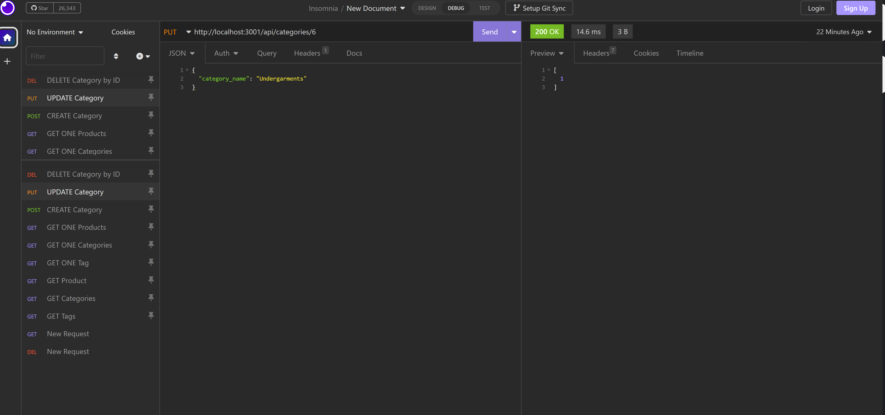

# eCommerce Mapping
Mapping the back end of an e-commerce website and displaying, with video, how the product works.

## Description

Taking the code that was provided and using the previous assignments and Google to assist with completing the items required to make the back end of this project work.  

Using the different tools, Insomnia, MySQL, Express.js and Sequelize packages to complete this has been a new challenge.  I've learned a lot with each of them, so now I'm feeling more comfortable using them. Even the use of the videos for the video walkthroughs. 

Personal [GitHub](https://github.com/labeutler/e-commerce-mapping) Link


### User Story

```md
AS A manager at an internet retail company
I WANT a back end for my e-commerce website that uses the latest technologies
SO THAT my company can compete with other e-commerce companies
```

### Acceptance Criteria

```md
GIVEN a functional Express.js API
WHEN I add my database name, MySQL username, and MySQL password to an environment variable file
THEN I am able to connect to a database using Sequelize
WHEN I enter schema and seed commands
THEN a development database is created and is seeded with test data
WHEN I enter the command to invoke the application
THEN my server is started and the Sequelize models are synced to the MySQL database
WHEN I open API GET routes in Insomnia for categories, products, or tags
THEN the data for each of these routes is displayed in a formatted JSON
WHEN I test API POST, PUT, and DELETE routes in Insomnia
THEN I am able to successfully create, update, and delete data in my database
```

## Table of Contents 

N/A

## Installation

THe following items will be required

* npm init
* npm install mysql2
* npm install sequelize
* npm install dotenv
* Insomnia

## Usage

To get started, you will need to run through the following steps in your terminal command line.
* mysql -u root -p
* enter password
* SOURCE db/schema.sql
* \q
* npm install
* npm run seed
* npm start

Once complete, then open Insomnia to review the information.  

### Please watch this video as to how we are [Connecting to the Database](/Connecting%20with%20Sequelize.mp4). The video will include a walkthrough of the following:

* Demonstrates the functionality of the e-commerce back end

* Show all of the technical acceptance criteria being met, from acceptance list above.

* Demonstrate how to create the schema from the MySQL shell.

* Demonstrate how to seed the database from the command line.

* Demonstrate how to start the application’s server.</br>


### Please watch this video as to how we are [GET Routes](./images/GET%20ALL.mp4) for ALL Categories, Products and Tags in Insomnia.

* Demonstrate GET routes for all categories, all products, and all tags being tested in Insomnia.


### Please watch this video as to how we are [GET Routes](./images/GET%20ONE.mp4) for ONE Category, Product and Tag in Insomnia.

* Demonstrate GET routes for a single category, a single product, and a single tag being tested in Insomnia.


### Please watch this video as to how we are [POST, PUT, and DELETE Routes](./images/POST%20PUT%20DELETE.mp4) for categories being tested in Insomnia.

* Demonstrate POST, PUT, and DELETE routes for categories, products, and tags being tested in Insomnia.



## Credits

[Error Code List Helper](https://umbraco.com/knowledge-base/http-status-codes/)

[Model Helper](https://stackoverflow.com/questions/23128816/sequelize-js-ondelete-cascade-is-not-deleting-records-sequelize)

## License

No license was selected for this project.

---